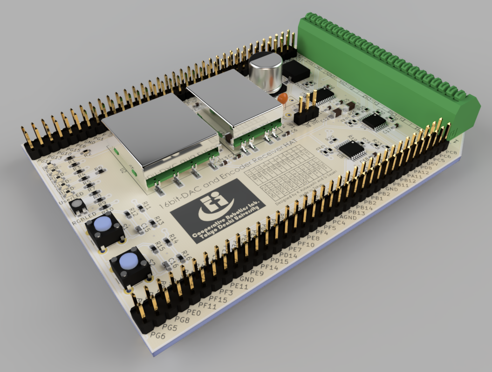

# Welcome to DAC-HAT

## What is DAC-HAT?
DAC-HAT is a library for the F767ZI or F746ZG that allows you to control the DAC-HAT board.
DAC-HAT includes a 16bit DAC (AD5754R), two differential line receivers, LEDs, and switches.

## Create circuit
If you want a DAC-HAT, upload the Gerber file to the company producing the circuit and order it.
For example, you can order from the following companies:
- [seeedstudio](https://www.seeedstudio.com/fusion_pcb.html)
- [JLCPCB](https://cart.jlcpcb.com/quote?orderType=1&stencilLayer=2&stencilWidth=100&stencilLength=100)

Follow the steps below to create a circuit.
1. Upload garvar.zip to PCB order website. 
1. PCB Thickness is recommended to be 1.6mm.
1. If ordering stencils, upload garvar.zip to the stencil as well.
1. Order the PCB.
1. Collect the parts according to the BOM file.
1. Mount the components on the PCB.
1. Solder All components.
1. Attach to F767ZI or F746ZG. At this time, change the board power source from U5V to E5V (moves the pin header).

## Usage
1. Please supply 24V to DAC-HAT.　Then, confirm that the white LED lights up.
1. Compile the sample code and generate a bin file.
1. Write the bin file to the board.
1. Check that the DAC-HAT is working properly.